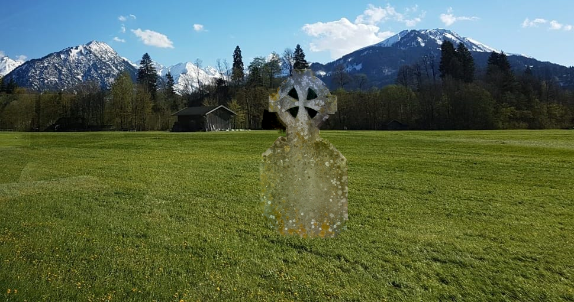
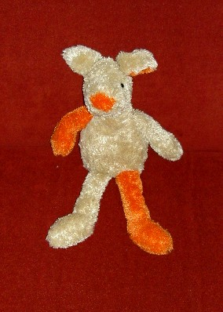
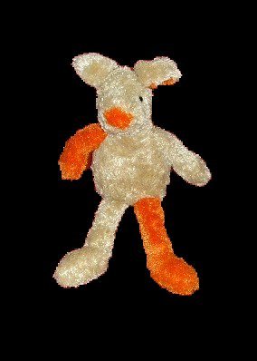

# GrabCut and Poisson Blending for Image Segmentation and Composition

This project implements two key techniques for natural image composition:

- **GrabCut** for foreground-background segmentation using graph cuts.
- **Poisson Blending** for seamless integration of the extracted object into a new background.

The goal is to isolate and transplant an object from one image to another in a visually consistent and edge-preserving manner.

## 🔍 Sample Results

### Poisson Blending Result

### Teddy: Source vs. Final Compositing
| Original Object | Final Result |
|-----------------|--------------|
|  |  |

## 📄 Full Report

For full implementation details, algorithmic explanations, and performance analysis — refer to the [project report (PDF)](./report.pdf).
