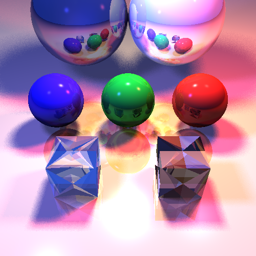

# Ray Tracer

This project implements a basic ray tracing engine from scratch, capable of rendering 3D scenes with geometric primitives, materials, lighting, and shading.

The engine simulates the way rays of light interact with surfaces to produce realistic images. Key features include:

- Recursive ray casting
- Lambertian diffuse shading
- Mirror reflections
- Basic camera control and image generation

## 🖼️ Rendered Output

> The output image demonstrates reflections, shadows, and perspective rendering of a simple 3D scene.

## 💻 Technologies Used

- C++ (standard libraries)
- Custom math utilities for vector and ray algebra
- PPM image output or PNG with external library (if used)

## 🚀 How to Run

1. Clone the repository  
2. Compile using a C++ compiler (e.g., `g++ main.cpp -o raytracer`)  
3. Run the program to generate output image  

---

Feel free to experiment with different scenes, camera positions, and surface properties!
